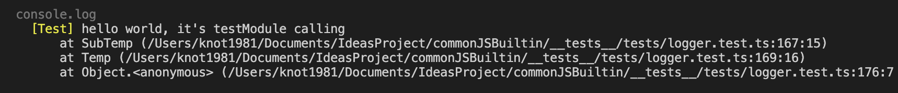

---
<!--#-->
### Feature
- 針對 trace/debug/info/warn/current/error/fatal 設置不同色彩
   
  
- logger 可設置 traceBack 由第幾個 stack 開始追蹤至第幾個結束
- 根據環境變數設置 overall log level
- 根據各別模組設置 log level

#### __型別__ | [source][s-logger]
```ts
abstract class LoggerMethods {
  abstract log(msg: any[], option?: LogOption): void;
  abstract trace(msg: any[], option?: LogOption): void;
  abstract info(msg: any[], option?: LogOption): void;
  abstract debug(msg: any[], option?: LogOption): void;
  abstract error(msg: any[], option?: LogOption): void;
  abstract fatal(msg: any[], option?: LogOption): void;
  abstract warn(msg: any[], option?: LogOption): void;
  abstract current(msg: any[], option?: LogOption): void;
}
```

#### __靜態方法__
```ts
abstract class LoggerStatic {
  abstract setCurrentEnv(envGetter: ()=>Env): void;
  abstract isDisallowed(option: AllowedModule<any>, level: ELevel): boolean;
  abstract  isAllowed(option?: AllowedModule<any>, level?: ELevel): boolean ;
  abstract toAllowedLogger<M extends string>(modules: AllowedModule<M>[]): RawAllowedLogger<M>;
  abstract setLevelColors(option: Partial<ColorConfig>): void;
  abstract  setLoggerAllowance<M extends string>(modules: AllowedModule<M>[]): RawAllowedLogger<M>;
  abstract setLoggerAllowanceByEnv<M extends string>(option: AllowedLoggerByEnv<M>): Partial<RawAllowedLogger<M>>;
  abstract hasModule<M>(option: AllowedModule<M>):boolean;
  abstract clearModules(): void;
}
```

### 袑始化
始始化有以下二種方式, 這二種方式不得混用
 * 1) [setLoggerAllowanceByEnv](#setLoggerAllowanceByEnv)
 * 2) [setLoggerAllowance](#setLoggerAllowance)
  
__[setLoggerAllowanceByEnv](#setLoggerAllowanceByEnv)__
```ts
// logger.setup.ts
enum EModules {
  Test = "Test",
  Hobbits = "Hobbits",
}
const testModule = {
  moduleName: EModules.Test,
  disallowedHandler: (level) => false,
};
const newModule = {
  moduleName: EModules.Hobbits,
  disallowedHandler: (level) => false,
}

Logger.setCurrentEnv("develop")
const LogModules = Logger.setLoggerAllowance(LogModules)

// 使用：arbitrary.test.source.ts
const D = new Logger(LogModules.Test)
```

__[setLoggerAllowance](#setLoggerAllowance)__
```ts
  // logger.setup.ts
  enum EModules {
    Test = "Test",
    Hobbits = "Hobbits",
  }
  const testModule = {
    moduleName: EModules.Test,
    disallowedHandler: (level) => false,
  };
  const newModule = {
    moduleName: EModules.Hobbits,
    disallowedHandler: (level) => false,
  }
  Logger.setCurrentEnv("develop")
  const LogModules = Logger.setLoggerAllowanceByEnv({
    test: [],
    develop: [],
    release: [testModule, newModule]
  });

  // 使用：arbitrary.hobbits.source.ts
  const D = new Logger(LogModules.Hobbits)

  // 使用：arbitrary.test.source.ts
  const D = new Logger(LogModules.Test)
```


### 設置色彩 
__型別__ | [source][s-logger]
```ts
// 內部使用 Color 套件
const defaultColorCaster: Record<ELevel, (msg: string) => string> = {
  [ELevel.trace]: (msg) => msg.grey,
  [ELevel.debug]: function (msg: string): string {
    return msg.white;
  },
  [ELevel.info]: function (msg: string): string {
    return msg.blue;
  },
  [ELevel.warn]: function (msg: string): string {
    return msg.yellow;
  },
  [ELevel.current]: function (msg: string): string {
    return msg.cyan;
  },
  [ELevel.error]: function (msg: string): string {
    return msg.red;
  },
  [ELevel.fatal]: function (msg: string): string {
    return msg.bgBrightRed;
  },
};

static setLevelColors(option: Partial<typeof defaultColorCaster>) {
  Object.assign(colorCaster, option);
}
```

__example__
```ts
const option = defaultColorCaster;
Logger.setLevelColors(option);
```

### 設置允許的 Logger
有以下二種方式
- [setLoggerAllowance](#setLoggerAllowance)
  不考慮 env, 設定什麼樣層級的 logger 允許被顯示, 不得與 [setLoggerAllowanceByEnv](#setLoggerAllowanceByEnv) 混用如混用會 raise AssertionError
- [setLoggerAllowanceByEnv](#setLoggerAllowanceByEnv)
  依據 env設定什麼樣層級的 logger 允許被顯示, 需要在 [setCurrentEnv](#setCurrentEnv) 後呼叫, 一樣不得與 [setLoggerAllowance](#setLoggerAllowance) 混用如混用會 raise AssertionError

#### setLoggerAllowance 
__型別__ | [source][s-logger]
```ts
/** 
* @typeParam M - 模組名
*/
export type AllowedModule<M> = {
  moduleName: M;
  disallowedHandler: (level: ELevel) => boolean;
};
export type AllowedLogger<M extends string> = Record<M, AllowedModule<M>>;

setLoggerAllowance<M extends string>(modules: AllowedModule<M>[]): RawAllowedLogger<M>{}
```

__example__ 
混用 setLoggerAllowanceByEnv - raise AssertionError

```ts
// 不考慮 env
Logger.setLoggerAllowance<EModules>([
  testModule, newLogModule
]);
const action = ()=> Logger.setLoggerAllowanceByEnv({
  test: [],
  develop: []
});
expect(action).toThrow();
expect(action).toThrowError("AssertionError");
```
#### AllowedModule
__型別__ | [source][s-logger.types]
```ts
export type AllowedModule<M> = {
  /** module identifier */
  moduleName: M;
  /** 判斷哪一層級的 {@link ELevel} 不被允許 */
  disallowedHandler: (level: ELevel) => boolean;
  /** 用來覆寫當前 log level, 預設為保持不變： (level)=>level */
  logLevelHandler?: (level: ELevel)=> ELevel;
};
```
__example__
```ts
enum EModules {
  Test = "Test",
  Hobbits = "Hobbits",
}
const testModule: AllowedModule = {
  moduleName: EModules.Test,
  // log level <= info 才被允許，換言之 trace / debug 不允許
  disallowedHandler: (l)=> l <= ELevel.info,
  // 不覆寫 log level, 如想將所有 log level 覆寫為 current:
  // logLevelHandler: (l)=>ELevel.current
  logLevelHandler: (l)=> l,
}
```


#### setLoggerAllowanceByEnv
__型別__ | [source][s-logger]
```ts
/** 
 * @see {@link AllowedLogger} 
 * @typeParam M - module name 
*/
export type AllowedLoggerByEnv<M extends string> = {
  production?: Partial<AllowedLogger<M>>;
  release?: Partial<AllowedLogger<M>>;
  develop: Partial<AllowedLogger<M>>;
  test: Partial<AllowedLogger<M>>;
};
setLoggerAllowanceByEnv<M extends string>(option: AllowedLoggerByEnv<M>){}
```

__example__
```ts
// 假定有以下二模組
enum EModules {
  Test = "Test",
  Hobbits = "Hobbits",
}
const ClientModule: AllowedModule<EModules> = {
  moduleName: EModules.Client,
  disallowedHandler: (level)=> false
}
const LogModules = defineAllowedLoggers([
  ClientModule,
  {...ClientModule, moduleName: EModules.AuthGuard},
  {...ClientModule, moduleName: EModules.RequestRep},
  {...ClientModule, moduleName: EModules.HeaderUpdater}
])
Logger.setLoggerAllowanceByEnv(LogModules)
```

__example__ | [source][s-test-logger]:
```ts
describe("Considering of using env", ()=>{
  let log: Logger<EModules>;
  function clear(env: Env, allowance: any[]){
    Logger.clearModules();
    setupCurrentEnv(env);
    Logger.setLoggerAllowanceByEnv(Object.assign({
      test: [],develop: []
    }, {
      [env]: allowance
    }) as any);
    log = new Logger(testModule);
  }

  beforeEach(()=>{
    clear("release", [testModule]);
  });

  test("setLoggerAllowanceByEnv - expect module not exists", () => {
    clear("test", [testModule]);
    setupCurrentEnv("develop");
    expect(_currentEnv.value).toBe("develop");
    console.log("allowedModules", (Logger as any).allowedModules)
    expect(Logger.hasModule(testModule)).toBeFalsy();
    Logger.clearModules();
  });

  test("setLoggerAllowanceByEnv - expect module exists", () => {
    expect(_currentEnv.value).toBe("release");
    expect(Logger.hasModule(testModule)).toBeTruthy();
    expect(log._allowance).toEqual(testModule);
  });

  test("trace logger, expect to be blocked since it's not dev mode", () => {
    expect(_currentEnv.value).toBe("release");
    expect(Logger.hasModule(testModule)).toBeTruthy();
    expect(log._allowance).toEqual(testModule);
    expect(Logger.isAllowed(log._allowance, ELevel.trace)).toBeFalsy();
  });

  test("warn logger, expect to be blocked since it's not dev mode", () => {
    function Temp() {
      function SubTemp() {
        log.warn(["hello world, it's testModule calling"], { stackNumber });
      }
      return SubTemp();
    }
    const stackNumber = 3;
    expect(_currentEnv.value).toBe("release");
    expect(Logger.hasModule(testModule)).toBeTruthy();
    expect(log._allowance).toEqual(testModule);
    expect(Logger.isAllowed(log._allowance, ELevel.warn)).toBeTruthy();
    Temp();
    expect(log._prevLog).not.toBeUndefined();
    expect(log._prevLog.stacksOnDisplay.length).toBe(stackNumber);
    expect(log._prevLog.stacksOnDisplay[0]).toContain("SubTemp");
    expect(log._prevLog.moduleName).toBe("Test");
  });
});
```